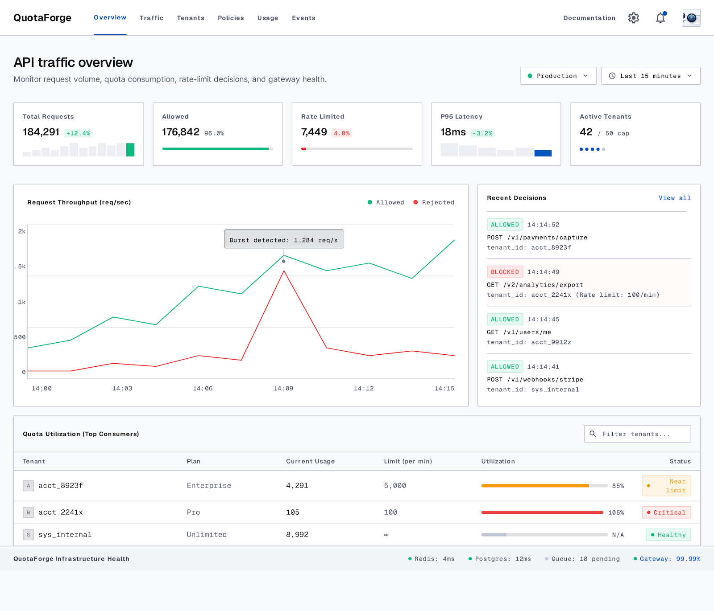
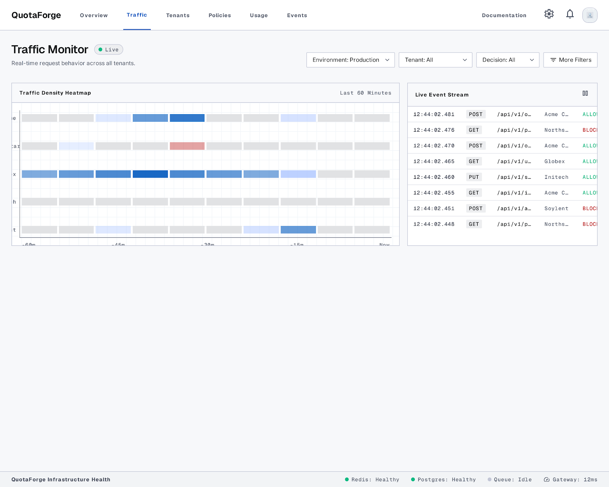
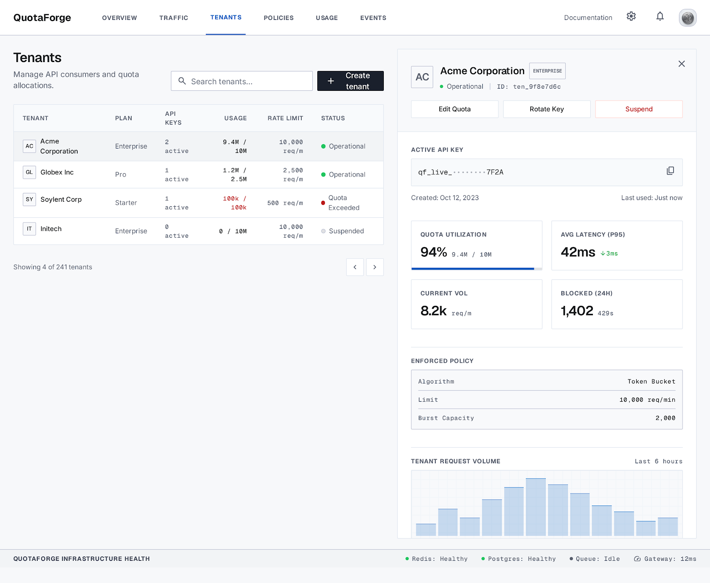
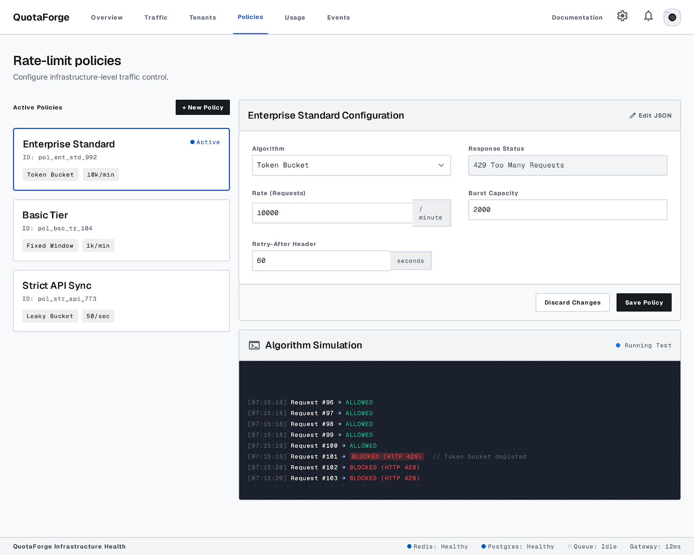
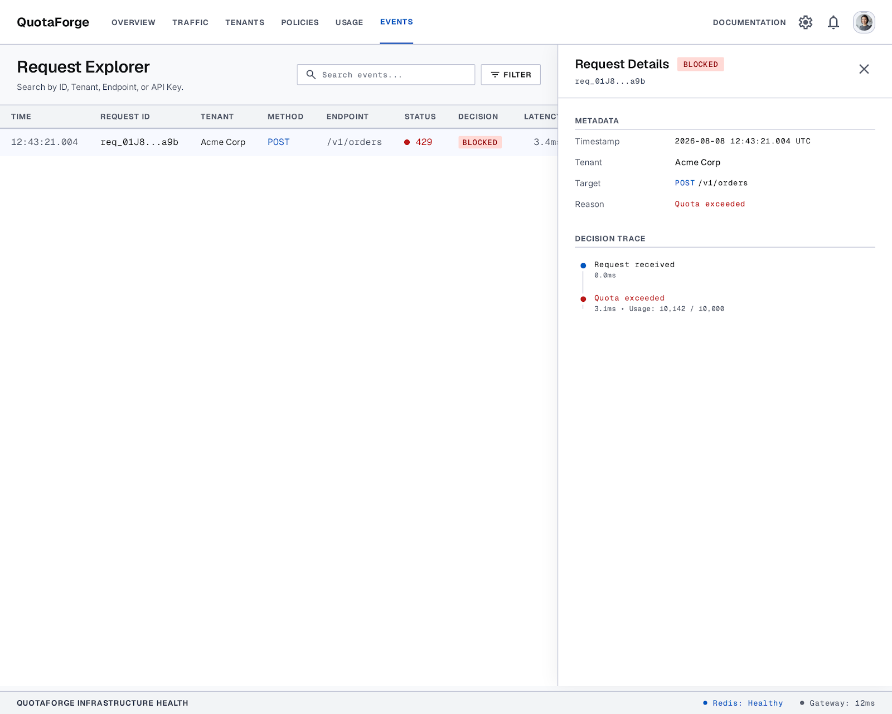
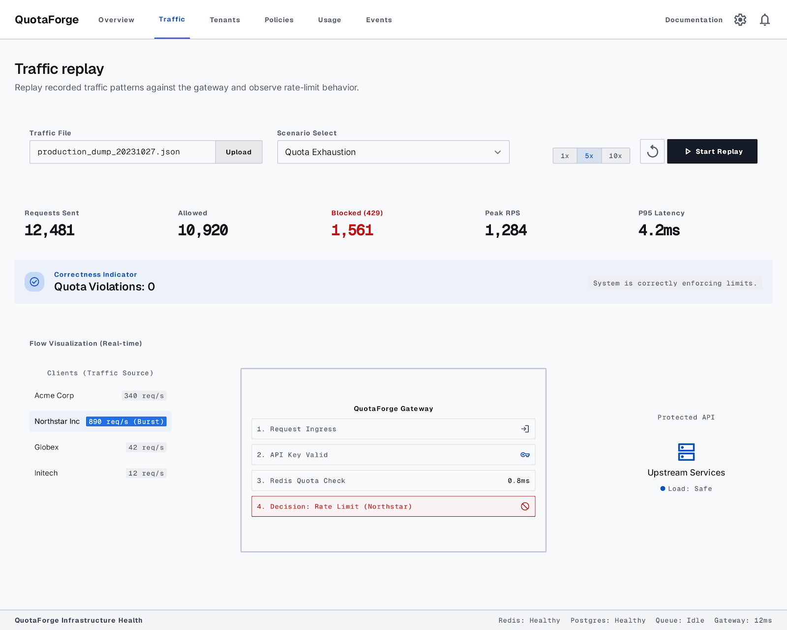
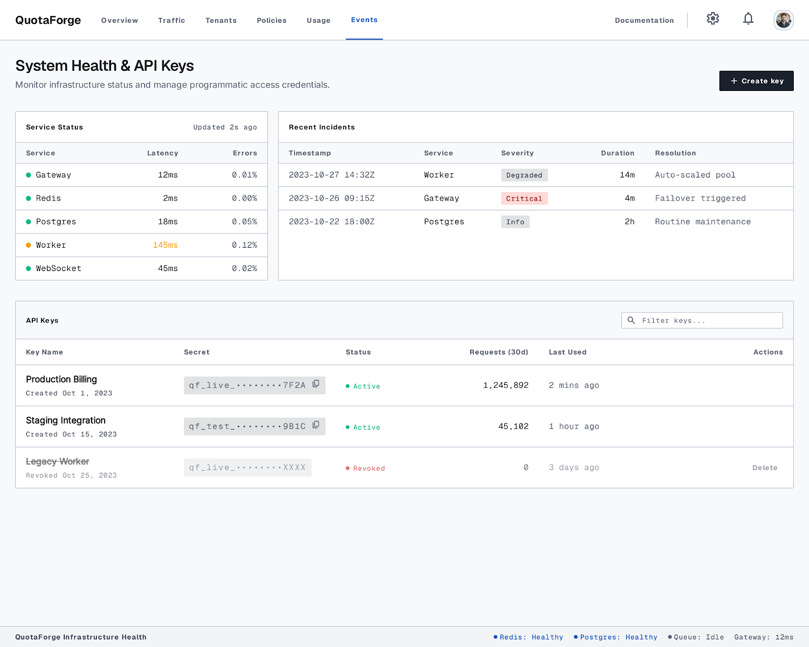
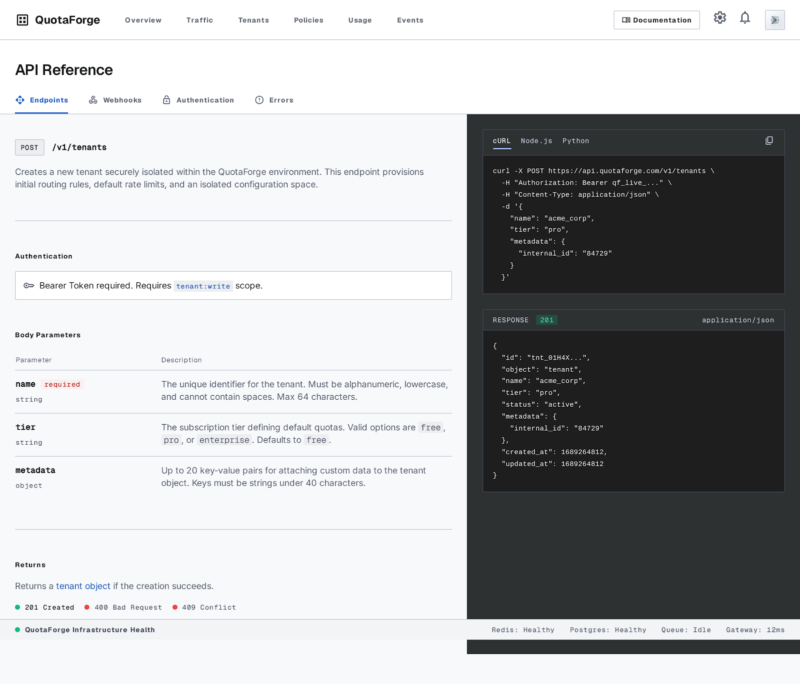

# 🚦 QuotaForge

### Multi-Tenant API Rate Limiting & Traffic Control Platform

[](https://quatoforge.vercel.app)
[](https://github.com/Praveenkanna16/Multi-Tenant-API-Rate-Limiting-Traffic-Control-Platform.git)

---

## 🌐 Live Production Link

👉 **[https://quatoforge.vercel.app](https://quatoforge.vercel.app)**

---

## 🧸 What is QuotaForge? (Explained Simply)

Imagine a super popular water park with a fun water slide. 

If 100 people try to jump on the slide at the exact same second, the slide will break and people will get hurt.

**QuotaForge is like a friendly traffic guard at the water slide:**
* It checks everyone's ticket (API Key).
* If you have turns remaining, it says **"Go ahead and have fun!" (HTTP 200 OK)**.
* If you used up all your turns too fast, it says **"Please wait 30 seconds before your next turn!" (HTTP 429 Too Many Requests)**.

This keeps the system fast, fair, and safe for everyone!

---

## 🗺️ How Does It Work? (Architecture)

```text
📱 User or App
       │
       ▼
🚦 QuotaForge Traffic Guard (/api/gateway/*)
       │
       ▼
🎟️ Fast Ticket Box (Redis Store)
       │
       ├─── 🟢 Within Limit? ────► Allow to Backend (HTTP 200 OK)
       │
       └─── 🔴 Over Limit?  ────► Stop & Say Wait! (HTTP 429 Too Many Requests)
```

1. **Request Arrives**: An app asks QuotaForge for permission.
2. **Ticket Check**: QuotaForge checks the customer's plan in under **1 millisecond**.
3. **Instant Decision**: If they have tokens left, they pass. If they ran out, they are blocked nicely with a countdown timer (`Retry-After`).

---

## 🖼️ Control Plane Visual Tour (Screenshots)

### 1. Traffic Overview Dashboard
*View total requests, allowed vs. blocked counts, and real-time system performance.*



---

### 2. Live Traffic Monitor
*Watch live API requests stream in real time like a radar screen.*



---

### 3. Tenant Management
*Create new API keys, assign plans (Free, Pro, Enterprise), and set request limits.*



---

### 4. Policy Configuration
*Pick tier rules and test how bursts of traffic get handled.*



---

### 5. Request Events Explorer & Decision Traces
*Search any request and inspect every step of the decision pipeline.*



---

### 6. Live Traffic Replay Engine
*Simulate high-concurrency traffic bursts and visualize live packet flows across nodes.*



---

### 7. System Health & Security Audit
*Check database speed, Redis memory usage, and API key encryption status.*



---

### 8. Developer API Reference & Docs
*Easy code examples in cURL, JavaScript, Python, and Go for developers.*



---

## ⚙️ Main Features

* 🚀 **Super-Fast Rate Checks**: Takes less than 1 millisecond.
* 🔒 **Zero Cheating Guarantee**: Prevents 500 requests at once from bypassing limits.
* 🎨 **Clean Control Plane**: Redesigned top navigation with clear visual telemetry.
* 🧪 **Traffic Replay Sandbox**: Test traffic bursts without touching real databases.
* 🔑 **Secure Key Hashing**: Stores API keys using SHA-256 encryption.

---

## 🛠️ How to Run Locally

```bash
# 1. Clone repo
git clone https://github.com/Praveenkanna16/Multi-Tenant-API-Rate-Limiting-Traffic-Control-Platform.git
cd Multi-Tenant-API-Rate-Limiting-Traffic-Control-Platform

# 2. Install dependencies
npm install

# 3. Setup database
npx prisma db push
npx tsx prisma/seed.ts

# 4. Start local server
npm run dev
```

Open `http://localhost:3000` in your browser!

---

## 🧪 Testing

```bash
# Run unit tests
npm test

# Run high-concurrency race condition test (100 parallel requests)
npm run test:concurrency
```

---

## 👨‍💻 Author

**Praveenkanna16**  
Live Deployment: [https://quatoforge.vercel.app](https://quatoforge.vercel.app)  
GitHub: [Praveenkanna16](https://github.com/Praveenkanna16)
